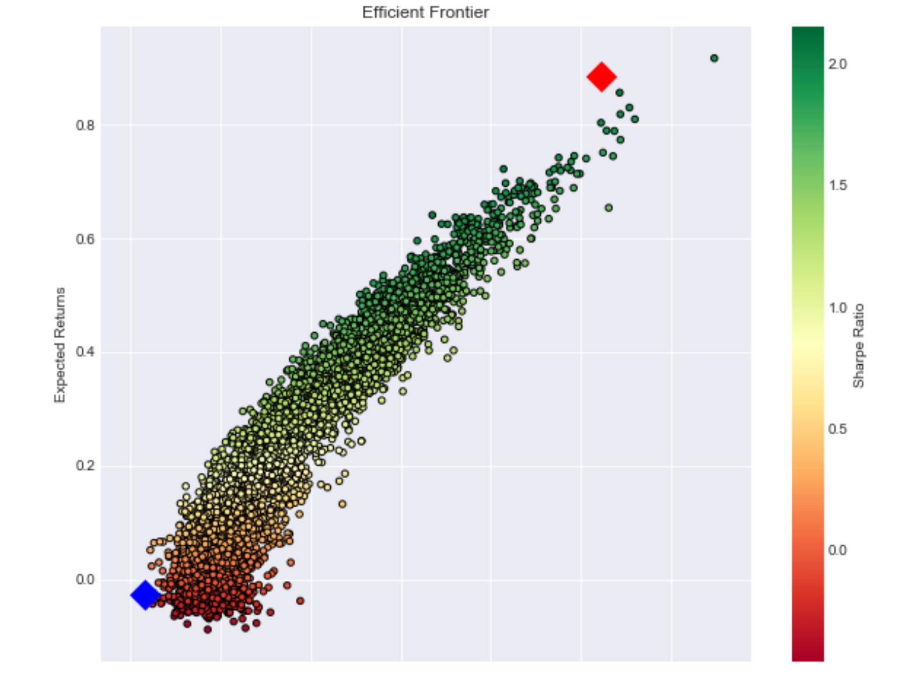
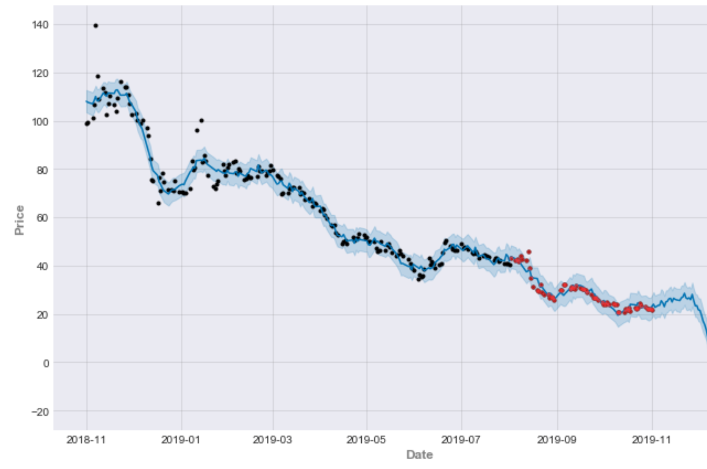

# PortfolioTools


About
--------
PortfolioTools is a library of tools for investment portfolio management, analysis, and modeling. It also contains
a brokerage API client for accessing account and position data as well as placing live trades.

This project encapsulates significantly many aspects of the home-cooked quant investment management process including but
not limited to: data extraction, transformation, and loading, scraping, portfolio optimization, algo-trading, backtesting,
risk analysis, PnL attribution, and security analysis.

Current Capabilities
------------


Get Your Positions:
```
import blakefolio as bf
pf = bf.portfolio(cf.refresh_token)

Returns:
	symbol	settledLongQuantity
	AAPL	1.0
	ROBO	5.0
	TLRY	8.0
	WMT 	2.0
	SPY 	3.0
	QQQ 	3.0
	OXLC	15.0
	FIT	15.0
	EA	1.0
	HPE	0.0
	BA	2.0
	VZ	3.0
	AMTD	21.0

```
Calculate and Plot the Markowitz Efficient Frontier:

```
pf.markowitz_ef(5000)
pf.plot_efficient_frontier()
```


```
Minimum Variance Portfolio:

Returns      -0.026668
Volatility    0.157591
Sharpe Ratio -0.169224
AAPL Weight   0.066078
ROBO Weight   0.027032
TLRY Weight   0.000087
WMT Weight    0.186679
SPY Weight    0.066000
QQQ Weight    0.089681
OXLC Weight   0.196079
FIT Weight    0.013370
EA Weight     0.042838
HPE Weight    0.017325
BA Weight     0.027880
VZ Weight     0.125112
AMTD Weight   0.141838


Maximum Sharpe Portfolio:

Returns       0.884215
Volatility    0.410954
Sharpe Ratio  2.151616
AAPL Weight   0.094793
ROBO Weight   0.028340
TLRY Weight   0.222700
WMT Weight    0.097078
SPY Weight    0.108019
QQQ Weight    0.003425
OXLC Weight   0.112864
FIT Weight    0.008235
EA Weight     0.003804
HPE Weight    0.031725
BA Weight     0.073967
VZ Weight     0.189797
AMTD Weight   0.025253
```


Run Time Series Price Prediction:
 ```
proph = bf.prophesy("TLRY", 1, "2019-08-01")
proph.gen_forecast(cycle = 20)
proph.forecast_plot()
```


```
Projected return per cycle: 3.62
MSE:  4.2379
MAE:  1.0667
R2:   0.9034
MSLE: 0.0041
MAE:  1.0667
```

Input Hypothetical Portfolio Positions:

```
from library.portfolio import Portfolio
assets = {'AAPL': 10, 'WMT': 20}
my_portfolio = Portfolio(assets)
```

Calculate Historical Portfolio Returns and Value:

```
my_portfolio.get_historical_asset_returns('2020-01-01', '2020-05-01')
my_portfolio.get_historical_portfolio_returns('2020-01-01', '2020-02-01')
my_portfolio.get_historical_portfolio_value('2020-01-01', '2020-03-01')
```

Calculate Important Portfolio/Asset Stats
```
my_portfolio.asset_corr()
my_portfolio.cumm_asset_returns()
my_portfolio.cumm_portfolio_returns()
my_portfolio.max_drawdown()
my_portfolio.sharpe_ratio()
my_portfolio.portfolio_skew()
my_portfolio.portfolio_kurtosis()
my_portfolio.asset_skew()
my_portfolio.asset_kurtosis()
```

Calculate Value at Risk
```
my_portfolio.parametric_var(modified=True)
my_portfolio.var_historic()
my_portfolio.cvar_historic()
```

Get Alpha and Beta

```
my_portfolio.asset_beta()
my_portfolio.portfolio_alpha("SPY")
```

Regress Factors for Stress Testing

```
Stress = StressTest(my_portfolio)
#factors = ['XLB', 'XLY', 'XLF', 'IYR', 'XLP', 'XLV', 'XLU', 'IYZ', 'XLE', 'XLI', 'XLK']
factors = ['USO', 'GLD', 'BIL', 'VIX']
Stress.set_factors(factors)
Stress.get_factor_data()
Stress.regress()

Returns:

                            OLS Regression Results                            
==============================================================================
Dep. Variable:                      y   R-squared:                       0.743
Model:                            OLS   Adj. R-squared:                  0.713
Method:                 Least Squares   F-statistic:                     25.24
Date:                Thu, 24 Sep 2020   Prob (F-statistic):           6.79e-10
Time:                        21:22:46   Log-Likelihood:                 143.30
No. Observations:                  39   AIC:                            -278.6
Df Residuals:                      35   BIC:                            -271.9
Df Model:                           4                                         
Covariance Type:            nonrobust                                         
==============================================================================
                 coef    std err          t      P>|t|      [0.025      0.975]
------------------------------------------------------------------------------
USO           -0.0101      0.071     -0.141      0.889      -0.155       0.134
VIX           -0.0994      0.013     -7.608      0.000      -0.126      -0.073
BIL            8.4911      5.237      1.621      0.114      -2.142      19.124
GLD            0.2796      0.135      2.075      0.045       0.006       0.553
==============================================================================
Omnibus:                        1.439   Durbin-Watson:                   2.061
Prob(Omnibus):                  0.487   Jarque-Bera (JB):                0.739
Skew:                           0.317   Prob(JB):                        0.691
Kurtosis:                       3.231   Cond. No.                         562.
==============================================================================


```